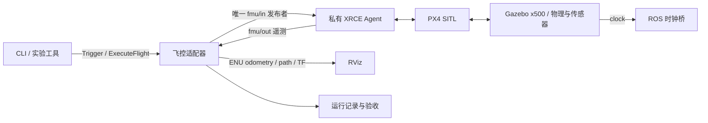

# 架构与系统边界

V0.1 先建立可靠的仿真和控制基础，后续系统按版本逐步接入。

监督进程负责组件就绪、域/端口/实例隔离以及自己创建的进程组。飞控适配器负责控制状态和飞控协议；CLI 只使用公开服务/动作。纯 Python 控制策略可脱离 ROS 注入故障验证，ROS 包负责消息、时钟、并发、TF 和记录。

## 六个系统

| 系统 | 输入 | 职责 | 输出 |
|---|---|---|---|
| 仿真实验室 | 世界、机型、传感器、故障配置 | 启停、数据生成、学习实验 | 传感器话题、独立真值、日志 |
| 自主系统 | 点云、IMU、图像、标定、导航目标 | 里程计、建图、重定位、三维规划 | 位姿及质量、地图、可执行轨迹 |
| 任务系统 | 巡检点、动作、约束 | 导航/采集调度，暂停、恢复、取消 | 任务进度、动作结果、数据关联 |
| 机队与控制 | 飞控状态、任务/操作者请求 | 遥测、控制权、指令确认、异常处理 | 飞行状态、控制结果、轨迹 |
| AI 巡检 | 图像、位姿、标定、几何 | 仪表/病害识别与空间定位 | 检测记录、证据、缺陷对象 |
| 数字孪生 | 点云、轨迹、多视角图像、检测 | 离线重建、配准、图层、版本 | 点云/Mesh/3DGS、巡检点、历史缺陷 |

各系统共用坐标/时间、配置、飞控适配和运行记录，不直接绕过公开接口控制飞控。V0.1 只有仿真、控制、实验和记录基础；其余系统按照 [ROADMAP](ROADMAP.md) 开发。

## 坐标、时钟和数据

- 平台 ENU/FLU，NED/FRD 转换集中在飞控适配层。
- V0.1 使用 odom。SLAM 增加 map → odom，回环修正不直接跳变控制目标。
- Gazebo 真值作为独立评估输入，不给 SLAM/规划器。V0.1 的位置验收只基于 PX4 估计，后续单独交付真值评估。
- 传感器保留源时间，仿真用 clock，通信超时用单调时钟，PX4 时间单独映射。
- 运行编号关联配置、依赖、标定、变换、状态、命令与原始数据。传感器阶段增加标定和数据回放契约。

数字孪生保留导航几何、实景展示、业务标注三个图层。导航用障碍地图，3DGS 用于浏览。任何测量必须附带几何来源与误差依据。

本机默认单无人机、单场景、低分辨率传感器，源码构建并发 2。在线主要运行仿真、定位与导航，AI 批处理、Mesh 和 3DGS 默认离线。算法先固定数据集回放，再实时闭环；真实硬件参数和标定到位后分别校准几何、动力学、传感器、时延和任务行为。
