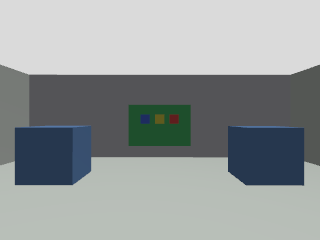

# V0.2.0 本机验收（2026-10-04）

代码提交 `32cb9903a934ba9ff14b04826b23b34cab4cbb95`：六个 ROS 包构建通过，74项回归通过。新增真实 ROS 回归涵盖传感器节点启动、源时间、姿态不可用、静态TF，以及多线程遥测处理顺序。

## 实际传感器与飞行

本机 Ogre2 EGL 使用 NVIDIA Corporation / NVIDIA GeForce RTX 3050 Laptop GPU（OpenGL）。初次 EGL 设备探测的 dri2 警告不影响最终渲染；实际雷达与图像数据经过验证。该证据只证明本版本的传感器渲染，不证明 CUDA 算法能力。

| 项目 | 结果 |
|---|---|
| 雷达 | 5760点/扫描、10Hz，具有竖直结构；实际运动数据有限采样点约93%，其余无回波允许为非有限值 |
| IMU | 200.0Hz，比力平均9.815m/s²；orientation_covariance[0]=-1 |
| 相机 / CameraInfo | 320×240 RGB、15.15Hz；源帧与内参一致 |
| 独立真值 | 25Hz，sim_world → truth_base_link，不接控制 TF 树 |
| 时间 / TF | 源时间递增、无倒退；四条安装静态TF匹配标定 |
| 三轮飞行 | 悬停最大误差0.10379 / 0.10011 / 0.09768m；每轮落地及解除解锁均确认 |
| 适配器退出 | armed AUTO_LAND 被独立观察到；7.6488秒内 landed + disarmed |

最终传感器飞行运行编号 `20261004T105308Z-58e07c96`。启动时功能修复尚未提交，因此 manifest 如实记录 dirty=true；该运行所用功能代码与32cb990一致，随后提交中包版本和文档变更不影响运行行为。运行的原始 manifest/configuration/PX4日志保留在本机 `.runtime`，摘要见 [飞行证据](v02-native-flights.json)、[故障证据](v02-native-fault.json)、[启动传感器检查](v02-sensor-readiness.json)。

## 记录和回放

数据集 `recordings/20261004T103659Z-5d426e73-104356-128d1b`，约470MB；请求墙钟80秒，源时长79.54秒，含实际起飞/航点/降落运动。11个话题全部非空：796次雷达、15908次IMU、1205张图像、1205条CameraInfo、1988条真值及clock/tf/静态TF/平台遥测。配置、标定与依赖副本以及bag文件的SHA256已保存。

离线 `bag-check` 通过；独立域77实际播放通过，播放器退出0、live audit通过，活动域42保持独立。best effort回放实收15890条IMU，最大间隔0.08s；这不是无损传输承诺。未来算法固定数据集基准应离线读取原bag，并按源间隔处理。

记录证据：[数据检查](v02-dataset-audit.json)、[回放检查](v02-replay-audit.json)、[数据来源/校验值](v02-dataset-provenance.json)。完整bag保留本机、不进入Git。下图直接来自rosbag中的RGB原始帧，源时间和帧名见 [图像来源](v02-camera.json)，不是界面截图。

## 发布门禁与限制

传感器及三轮飞行本机门禁已通过；原flight配置回归、最终审查和本版干净CI仍在进行，尚未发布v0.2.0标签。V0.1旧版的干净CI证据不能代替新提交验收。

模型为学习用途；0.05kg载荷、通用同步扫描、白噪声IMU、无畸变相机，尚无Mid-360逐点时间、真实时延、SLAM、无GNSS飞行或自动避障。生成参数源与数据契约见 [V0.2设计](../superpowers/specs/2026-10-04-v02-sensors-design.md)。
